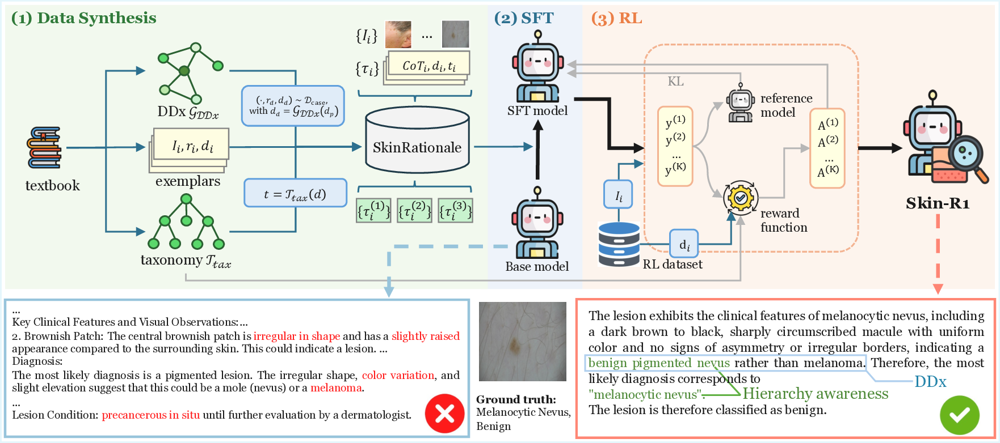

<h1 align="center">
  
  Skin-R1: Textbook-Grounded Reasoning and Reinforcement Learning for Dermatological Diagnosis (ECCV 2026)
</h1>

<p align="center">
  <a href="https://arxiv.org/pdf/2511.14900"></a>
  <a href="https://huggingface.co/zml5418/SkinR1-Qwen2.5-VL-7B-LoRA"></a>
</p>

Skin-R1 is a dermatology vision–language model (VLM) that combines **textbook-grounded clinical reasoning** with **reinforcement learning (RL)** for scalable diagnostic reasoning on Qwen2.5-VL.

> Vision–language models show promise for dermatological diagnosis, but trustworthiness remains limited by inconsistent labels, missing grounded rationales, and poor transfer from small annotated sets to large sparse collections. **Skin-R1** addresses this with: (1) **SkinRationale** — a textbook-based dataset of hierarchy-aware and differential-diagnosis (DDx) reasoning trajectories; (2) supervised fine-tuning (SFT) on SkinRationale; and (3) RL with a hierarchy-aware reward on sparse public datasets.

## Method overview

<p align="center">
  
</p>

<p align="center"><sub>Stage 0: SkinRationale synthesis → Stage 1: SFT → Stage 2: GRPO RL → evaluation.</sub></p>

## Model weights

The released checkpoint is a **LoRA adapter only** (not full model weights), built on [`Qwen/Qwen2.5-VL-7B-Instruct`](https://huggingface.co/Qwen/Qwen2.5-VL-7B-Instruct):

**[zml5418/SkinR1-Qwen2.5-VL-7B-LoRA](https://huggingface.co/zml5418/SkinR1-Qwen2.5-VL-7B-LoRA)**

Load it with PEFT on top of the base model, or **merge** the adapter into the base weights before inference—either approach is supported; see the notes below on eval behavior.

## Important notes

> [!WARNING]
> **PDF extraction is layout-sensitive.** SkinRationale synthesis from textbooks strongly depends on per-PDF text-matching rules, font/layout settings, and MONET configuration (e.g. `pdf_files.config.json`). Quality can vary across PDF editions or layouts; tune these settings before running the LLM and SkinRationale generation steps.

> [!NOTE]
> **SFT → GRPO reuses the same LoRA adapter.** GRPO resumes from the SFT LoRA checkpoint (continuing the same adapter weights) rather than initializing a fresh LoRA on the base model. We do not have a clear explanation for why, but in our experiments this consistently worked better.

> [!NOTE]
> **Use separate Python environments for Stage 0 and training.** `data_construction/requirements.txt` pins `transformers==4.39.1` (MONET); `model_training/requirements.txt` pins `transformers==4.52.3` (Qwen2.5-VL). Install each in its own venv and run Stage 0 from `data_construction/`, then SFT / GRPO / eval from `model_training/`.

> [!CAUTION]
> **Pin `transformers==4.52.3` for training and eval.** Our SFT / GRPO / eval stack uses the version in [`model_training/requirements.txt`](model_training/requirements.txt). For unknown reasons, other `transformers` releases—even when they install without dependency conflicts—can cause parallel-decoding issues on Qwen2.5-VL, often showing up as meaningless tokens in the output (e.g. repeated `addCriterion`; see [QwenLM/Qwen3-VL#759](https://github.com/QwenLM/Qwen3-VL/issues/759)).

> [!IMPORTANT]
> **Evaluation does not merge LoRA.** Our eval pipeline loads the adapter on the frozen base model without calling `merge_and_unload()`. Whether the adapter is merged can change response behavior; the underlying reason is not fully understood. For paper-comparable results, follow `model_training/scripts/run_eval.sh` as-is; you may merge at inference time if you prefer.

## Repository layout

```
Skin-R1/
├── assets/
│   ├── skin_icon.png        # Model icon (README header)
│   └── skin_r1_method.png   # Method overview figure
├── data/                    # Stage 0 storage (SKIN_R1_DATA_DIR)
├── data_construction/       # Stage 0 code + scripts
└── model_training/          # SFT / RL / eval
    └── data/                # Training inputs (SKIN_R1_DATA_ROOT)
```

**Two data roots (do not confuse them):**

| Variable | Default | Purpose |
| --- | --- | --- |
| `SKIN_R1_DATA_DIR` | `<repo>/data` | PDFs, Stage 0 outputs, SkinRationale (`sft_dataset/`) |
| `SKIN_R1_DATA_ROOT` | `model_training/data` | SFT / RL / eval inputs for training scripts |

Textbook PDFs for **data construction** and public datasets are not shipped (see `.gitignore`).

## Quickstart

Detailed steps live in the sub-READMEs linked below.

### Full reproduction (from PDF)

```bash
# ── Stage 0 (venv: data_construction/requirements.txt) ──
cd data_construction && pip install -r requirements.txt
# PDF → ../data/pdfs/<name>.pdf ; OPENAI_API_KEY in .env

bash scripts/run_stage0_pre_cluster.sh
# Manual: review $RUN_DIR/pdf_outputs.clustering/kmeans_label_lower.csv

bash scripts/run_stage0_post_cluster.sh bbc_<timestamp> "02_01 02_03 01 00 03"
bash scripts/run_filter.sh                         # interactive image curation
bash scripts/run_stage0_post_cluster.sh --finish    # → SkinRationale in model_training/data/trajectory_v2/

# ── Stage 1–2 + eval (venv: model_training/requirements.txt) ──
cd ../model_training && pip install -r requirements.txt
bash scripts/run_sft.sh   # defaults to smoke run; edit run_sft.sh for full training

# synonym_and_subtype2.json already copied by Stage 0 --finish
# Place six public RL datasets under data/RL/ (see model_training/README.md)
bash scripts/build_rl_dataset.sh

SFT_CHECKPOINT=output/SFT_trajectory_<TS>/module_checkpoint/module_epoch_4 \
  bash scripts/run_rl.sh

huggingface-cli download foreverbeliever/OmniMedVQA \
  --repo-type dataset --local-dir data/OmniMedVQA
export SKIN_R1_DDX_GRAPH=../data/outputs/<run>/ddx_graph_merged.json
bash scripts/build_eval_datasets.sh

CHECKPOINT_PATH=output/RL_openr1_<TS>/lora_checkpoint/lora_step_1500 \
  bash scripts/run_eval.sh
```

### Training only (data already prepared)

See [`model_training/README.md`](model_training/README.md).

## Sub-READMEs

| Path | Contents |
| --- | --- |
| [`data/README.md`](data/README.md) | Stage 0 layout; SkinRationale under `sft_dataset/` |
| [`data_construction/README.md`](data_construction/README.md) | PDF pipeline, LLM steps, SkinRationale synthesis |
| [`model_training/README.md`](model_training/README.md) | SFT, RL, eval scripts |
| [`model_training/data/README.md`](model_training/data/README.md) | Expected training data tree (`trajectory_v2/`) |

## Environment variables

| Variable | Module | Meaning |
| --- | --- | --- |
| `SKIN_R1_DATA_DIR` | data_construction | Stage 0 data root (default `<repo>/data`) |
| `RUN_DIR` | data_construction | Active run under `data/outputs/`; written to `data/outputs/.env_run` |
| `SKIN_R1_DATA_ROOT` | model_training | Training / eval data root (default `model_training/data`) |
| `SKIN_R1_DDX_GRAPH` | model_training | `ddx_graph_merged.json` from Stage 0 (for `ddx` eval) |
| `SKIN_R1_RL_PROMPT_FORMAT` | model_training | RL prompt type (default `4`) |
| `SKIN_R1_CACHE_DIR` | model_training | HuggingFace cache |
| `PDF_NAME` | data_construction | PDF basename in `data/pdfs/` (no `.pdf`) |
| `MONET_SRC` | data_construction | MONET source (default `MONET-main/src`) |
| `OPENAI_API_KEY` | data_construction | LLM API key (`.env` in `data_construction/`) |

Base model: `Qwen/Qwen2.5-VL-7B-Instruct`. Paper hardware: 1× A100 40GB (SFT), 2× A100 40GB (GRPO).

## License

Skin-R1 code in this repository (excluding vendored third-party trees such as `data_construction/MONET-main/` and `model_training/open_r1/`) is released under the [MIT License](LICENSE).

## Citation

```bibtex
@article{liu2025skin,
  title={Skin-R1: Clinical Knowledge-Guided Dermatological Diagnosis Using Vision-Language Models},
  author={Liu, Zehao and Ren, Weijieying and Zhang, Jipeng and Zhao, Tianxiang and Zhu, Jingxi and Li, Xiaoting and Honavar, Vasant G},
  journal={arXiv preprint arXiv:2511.14900},
  year={2025}
}
```
